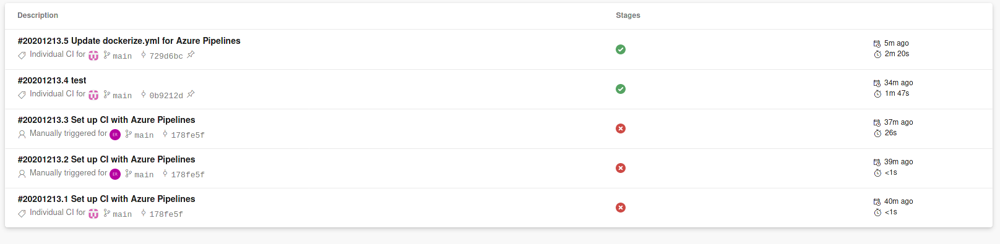
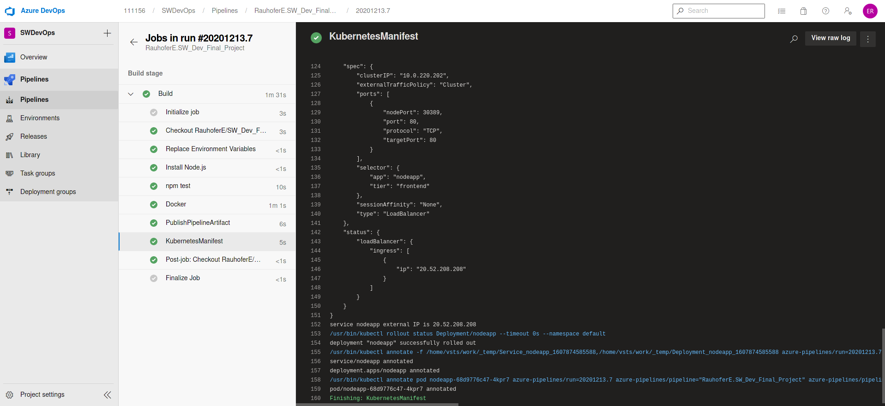
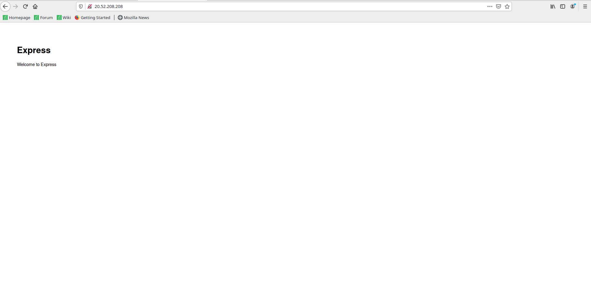

# SWD - Final Project
Link to Public Endpoint: http://20.52.208.208/  

Link to Docker Image Registry: https://hub.docker.com/repository/docker/104609/final_sw_depl_project/general  

Link to Public Docker Image on Docker Hub: https://hub.docker.com/r/104609/final_sw_depl_project  

# Summary
Every update commit to the GIT repository will trigger the Azure DevOps pipeline and:
- create a Docker image of the express application
- deploy the created image to docker hub (Docker registry): https://hub.docker.com/repository/docker/104609/final_sw_depl_project/general
- deploy the created image to an AKS Cluster: http://20.52.208.208/

Commits to master branch trigger pipeline:

Successfull Build:

Working App:

